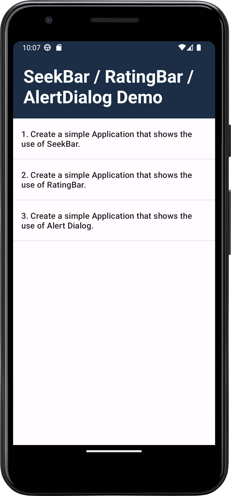
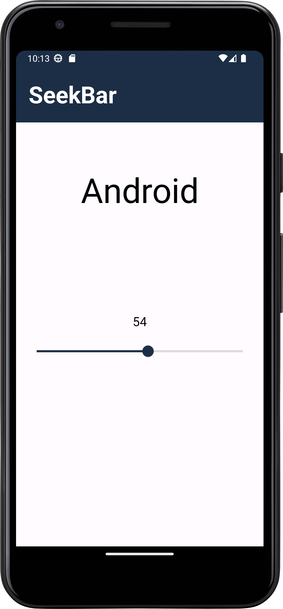
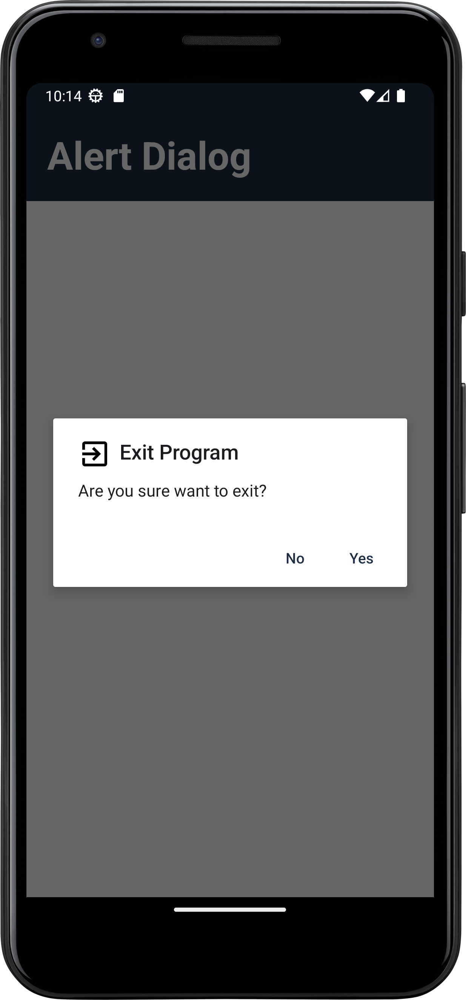

# About
This Android application demonstrates the usage of SeekBar, RatingBar, and AlertDialog in a simple project. It provides a straightforward implementation to showcase the functionality and interaction of these UI components.

# Features


- SeekBar: Allows the user to select a value from a range of values by moving a thumb along a horizontal line.
- RatingBar: Enables users to rate content using stars.
- AlertDialog: Displays alert messages to the user with customizable buttons for various actions.

       
# Tools used

- Android Studio
- Java Development Kit (JDK)
- Android SDK
  
# How to install?

- Step:1
    Clone the repository:

```
git clone https://github.com/DharmjeetVala/SeekBar-RatingBar-AlertDialog-Demo.git
```
- Step:2 
    Open the project in Android Studio.
- Step:3 
    Build the project to download the necessary dependencies.
- Step:4
    Run the app on an emulator or physical device.

# Preview:
<div style="display: flex; flex-wrap: wrap; gap: 30px;">
    
    
    
    
</div>


<br/><br/>
Thanks

Regards ~ Dharmjeet Vala


